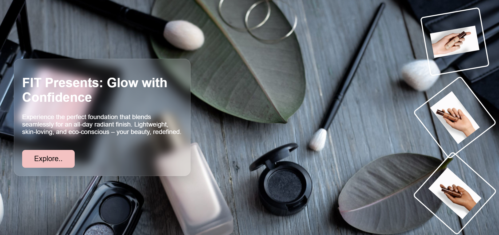
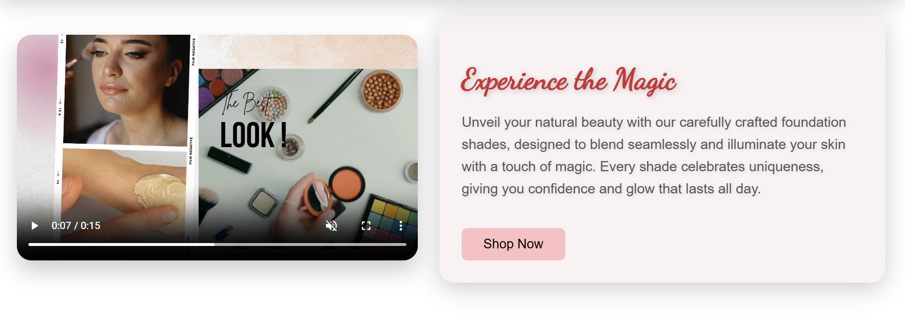

# FIT Foundation Makeup Product

A beautiful, modern, and interactive product landing page for **FIT Foundation**, showcasing flawless foundation shades with a glassy UI, responsive design, and immersive animations.

---

## ✨ Features

### 💄 Product Gallery
- Explore a gallery of foundation shades with smooth hover effects

### 🌿 Eco & Dermatology Friendly
- Eco-friendly and dermatologist-approved product highlights

### 🎨 Glassy UI & Animations
- Custom glassy UI with parallax background and rotating product images

### 🎥 Video Section
- Integrated product video section for an immersive experience

### ⚡ Responsive Design
- Works perfectly on desktop, tablet, and mobile

### 🔄 Cyclic Slider
- Automatically showcases product features with smooth transitions

## 🚀 Live Demo

Experience the live website:  
[Open FIT Foundation](https://spurthikongara.github.io/FIT-Foundation-MakeupProduct/)

---

## 🛠️ Tech Stack

- **HTML** – Structure  
- **CSS** – Styling, glassy effects, animations  
- **JavaScript** – Scroll animations, cyclic slider, interactive gallery  

---

## 📸 Screenshots

### Homepage
  

### Gallery & Features Section
  

---

## 💡 How to Run Locally

1. Clone the repository:  
```bash
git clone https://github.com/SpurthiKongara/FIT-Foundation-MakeupProduct.git


---

## 📂 Folder Structure
```bash
FIT-Foundation-MakeupProduct/
├── index.html # Main HTML page
├── style.css # Styling for the website
├── script.js # JavaScript for animations and slider
├── images/ # Product images, background, and video
│ ├── foundation1.jpg
│ ├── foundation2.webp
│ ├── foundation3.jpg
│ ├── pro3.jpg
│ ├── beau.jpg
│ ├── img1.png
│ ├── img2.png
│ ├── img3.png
│ ├── video.mp4
│ └── background.png
└── screenshots/ # Screenshots of the website UI
├── Screenshot1.png
└── Screenshot2.png


